### Table of Content:  
- 1) Loading library ggplot2  
- 2) Scatter plot creation  
- 3) Scatter plot customization    
- 4) Manual control over plot’s charaters  
- 5) Line chart  
- 6) Bar chart  
- 7) Box Plot  
- 8) stat plot  
- 9) Facets   
- 10) Using global and local aesthetics   

### **References:**
- https://r4ds.had.co.nz/data-visualisation.html  
- SP19 Applied data science study resources  

### ggplot Template
`
ggplot(data = <DATA>) +   
  <GEOM_FUNCTION>(mapping = aes(x = <var_name>, y = <var_name>, colour = <var_name), size = <var_name>, alpha = <var_name>, shape = <var_name>)
`

### 1) Loading library ggplot2  


```r
library(ggplot2)
```

### 2) Scatter plot creation
- Using inbuilt data "mpg" to create scatter plot
- Scatter plots indicate relation of one variable to other
- `geom_point` is used for the scatter plot


```r
ggplot(data = mpg) +
  geom_point(mapping = aes(x=displ, y=cty))
```

<!-- -->

### 3) Scatter plot customization  
- *Adding additional parameters inside `aes` function creates rules for given parameter and ggplot will decide the appearance*
- *Adding additional parameters outside `aes` function gives manual control over those parameters*
- *Parameters:*
    - color : To decide color of points based on values of a categorical/continuous variable
    - size  : To decide size of points based on values of a categorical/continuous variable
    - shape : To decide shape of points based on values of a categorical/continuous variable
    - alpha : To decide transparency of points based on values of a categorical/continuous variable
    - stroke: To decide size of points based on numerical value provided for stroke parameter 
  
- In color, shape and size , if a categorical field is used then number of colors/shapes/sizes are used (for ex. distinct colors for every value of the variable). But if a continuous variable is used then these aesthetics vary gradually as per the values of the variable. For ex. Light blue to dark blue color for a variable like "cty" (mileage is city)


```r
## Using various parameters in aes function
ggplot(data = mpg) +
  geom_point(mapping = aes(x = displ, y = cty, color = class, size = cyl, shape = drv, alpha=year))
```

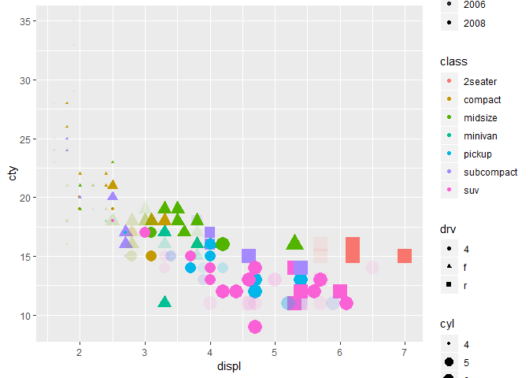<!-- -->

```r
## Using boolean condition to decide color 
ggplot(data=mpg) +
  geom_point(mapping = aes(x=displ, y=cty, colour = cyl <= 5))
```

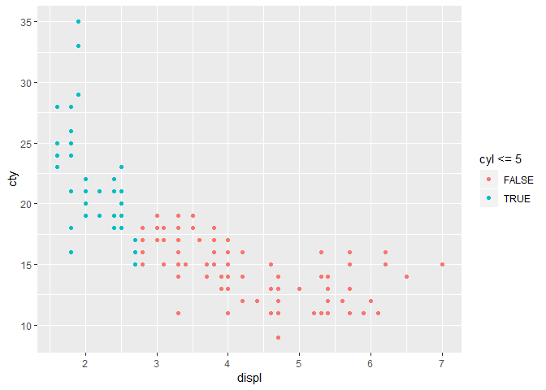<!-- -->

```r
## Use of stroke
ggplot(data=mpg) +
  geom_point(mapping = aes(x=displ, y=cty, colour = drv, stroke = 3))
```

<!-- -->

### 4) Manual control over plot's charaters
- *Adding additional parameters outside `aes` function gives manual control over those parameters*
- The name of a color as a character string.  
- The size of a point in mm.  
- The shape of a point as a number, as shown in Figure:  
  

R has 25 built in shapes that are identified by numbers. There are some seeming duplicates: for example, 0, 15, and 22 are all squares. The difference comes from the interaction of the `colour` and `fill` aesthetics. The hollow shapes (0–14) have a border determined by`colour` the solid shapes (15–18) are filled with `colour` the filled shapes (21–24) have a border of `colour` and are filled with `fill`.  

Source :https://r4ds.had.co.nz/data-visualisation.html  


```r
ggplot(data = mpg) + 
  geom_point(mapping = aes(x = displ, y = hwy), color = "blue", shape = 24, fill = "red", size = 3)
```

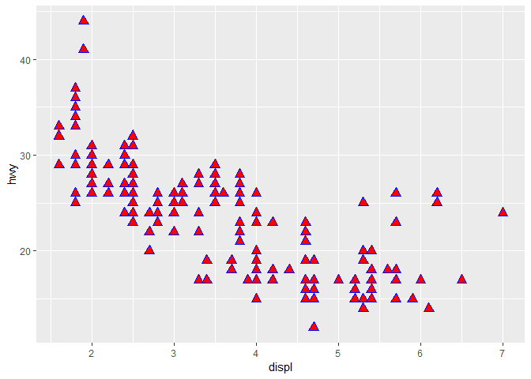<!-- -->

### 5) Line chart   
- Using `geom_smooth()` to plot line plot  
- Plotting scatter plot and line plot  


```r
# Plotting line charts with variations on "drv" attribute of mpg dataset
ggplot(data=mpg) +
  geom_smooth(mapping=aes(x=displ, y=cty, group=drv, linetype=drv, color=drv))
```

```
## `geom_smooth()` using method = 'loess' and formula 'y ~ x'
```

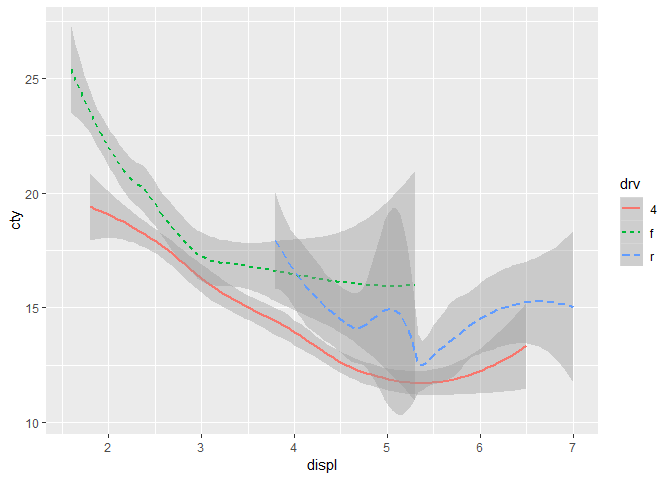<!-- -->

```r
# Plotting line charts and scatter plot 
ggplot(data=mpg) +
  geom_point(mapping = aes(x=displ, y=hwy), color='red') +
  geom_smooth(mapping = aes(x=displ, y=hwy))
```

```
## `geom_smooth()` using method = 'loess' and formula 'y ~ x'
```

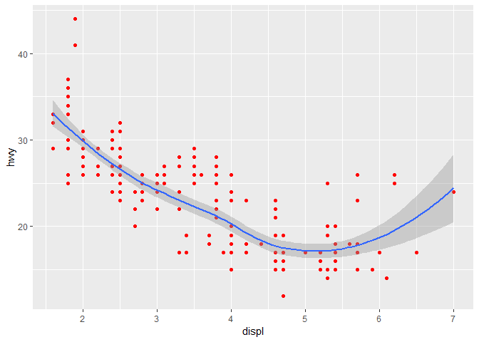<!-- -->

```r
# Using linetype , se (confidence interval)
ggplot(data=mpg, mapping=aes(x=displ, y= hwy )) +
  geom_point(mapping=aes(color=drv, stroke=2)) +
  geom_smooth(mapping= aes(linetype=drv),se=FALSE)
```

```
## `geom_smooth()` using method = 'loess' and formula 'y ~ x'
```

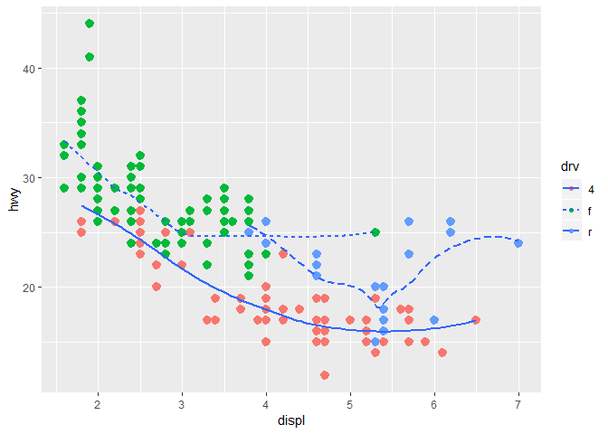<!-- -->

### 6) Bar chart
- Using `geom_bar()` and `geom_col()`  
- From R documentation :  
There are two types of bar charts: geom_bar() and geom_col(). geom_bar() makes the height of the bar proportional to the number of cases in each group (or if the weight aesthetic is supplied, the sum of the weights). If you want the heights of the bars to represent values in the data, use geom_col() instead. geom_bar() uses stat_count() by default: it counts the number of cases at each x position. geom_col() uses stat_identity(): it leaves the data as is.  

- Usage of ..prop.. to plot a bar chart using proportion of elements  


```r
## Bar chart to show count of records on y axis

ggplot(data=diamonds, mapping=aes(x=color)) +
  geom_bar(color = 'red') 
```

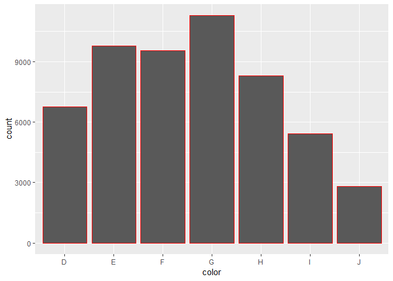<!-- -->

```r
## Bar chart with a chosen attribute on y axis
ggplot(data=diamonds, mapping=aes(x=color)) +
  geom_col(mapping=aes(y=price),color='blue', alpha=1/10)
```

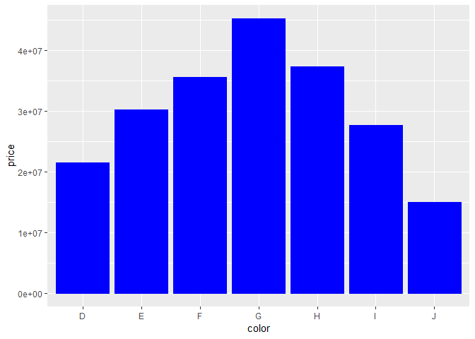<!-- -->

```r
## Usage of ..prop.. to plot a bar chart using proportion of elements
ggplot(data = diamonds) + 
  geom_bar(mapping = aes(x = cut, fill = color, y = ..prop.., group=1))
```

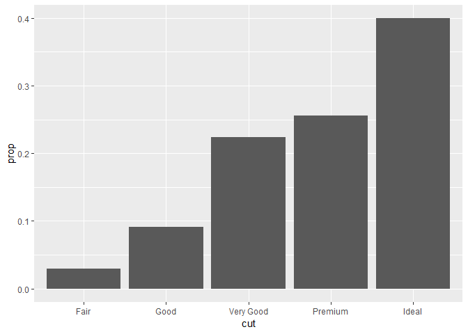<!-- -->

### 7) Box plot  
- `geom_boxplot()` to plot the box plot  
- `coord_flip()` to rotate the box plot   

```r
ggplot(data = mpg, mapping = aes(x = class, y = hwy)) + 
  geom_boxplot() +
  coord_flip()
```

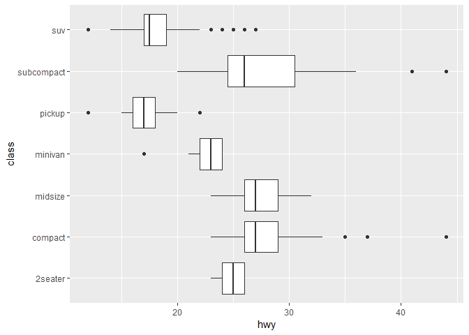<!-- -->

### 8) stat plot  
- `stat_summary()` plots data obtained by statistical functions such as max, min, median on attributes of the dataset  
- `fun.ymin, fun.y, fun.ymax ` : supply three individual functions that are each passed a vector of x's and should return a single number.  


```r
ggplot(data = diamonds) + 
  stat_summary(
    mapping = aes(x = cut, y = depth),
    fun.ymin = min,
    fun.ymax = max,
    fun.y = median
  )
```

<!-- -->

### 9) Facets :  
- `facet_wrap()` : To facet the plot by a single variable  
- `facet_grid()`  : To use facet with two variables  
- Facet wrap created using facet grid : use "." to create facet using just one variable 


```r
## To facet the plot by a single variable
ggplot(data = mpg) +
  geom_point(mapping = aes(x=displ, y=hwy, color = class, stroke = 2)) +
  facet_wrap(~ class, nrow=1)
```

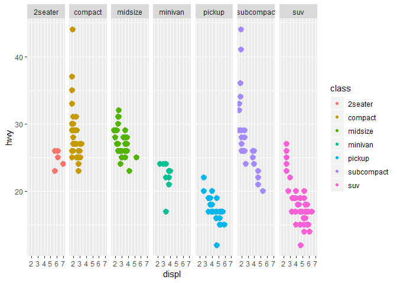<!-- -->

```r
## To use facet with two variables
ggplot(data=mpg) +
  geom_point(mapping = aes(x=displ, y=cty, colour=class)) +
  facet_grid(drv ~ cyl)
```

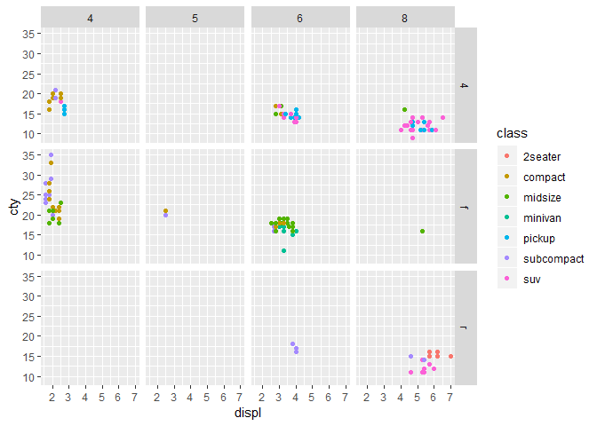<!-- -->

```r
## Facet wrap created using facet grid : use "." to create facet using just one variable :
ggplot(data=mpg) +
  geom_point(mapping = aes(x=displ, y=cty, colour=class)) +
  facet_grid(. ~ drv)
```

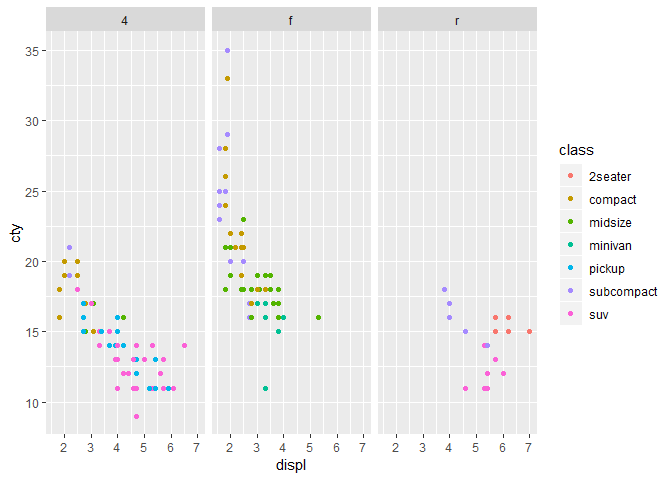<!-- -->

### 10) Using global and local aesthetics :
- To avoid duplication of code, we can specify aestetics at ggplot level and at individual plot level also  
- aesthetics defeined at ggplot level is applicable to all plots, hence global  
- aesthetics defeined at individual plot levels apply to those individual plots, hence local  


```r
ggplot(data=mpg, mapping=aes(x=displ, y= hwy )) +        ## global aestetics
  geom_point(mapping=aes(color=drv, stroke=2)) +         ## local aestetics for scatter plot
  geom_smooth(mapping= aes(linetype=drv),se=FALSE)       ## global aestetics for line chart
```

```
## `geom_smooth()` using method = 'loess' and formula 'y ~ x'
```

<!-- -->


