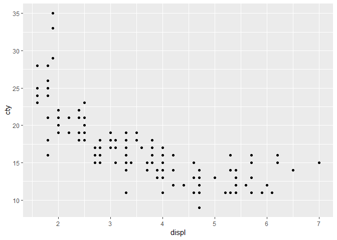
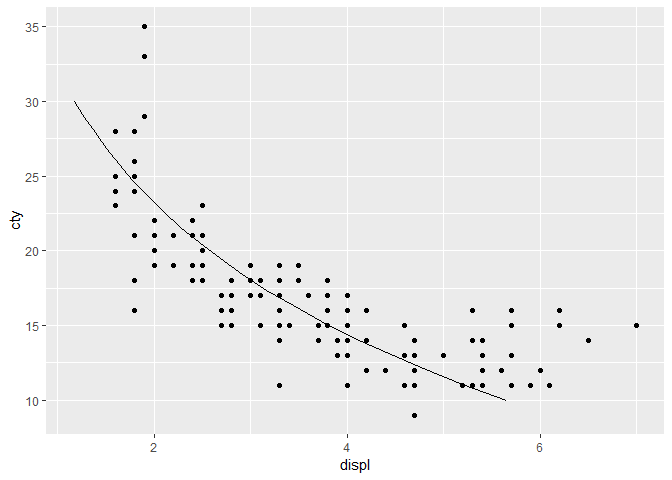
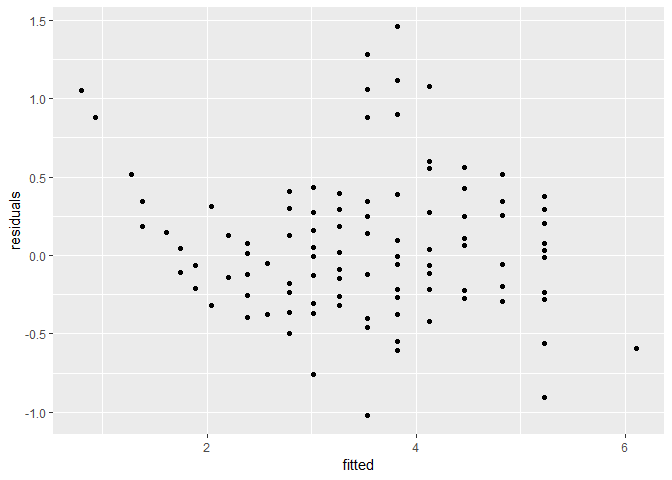
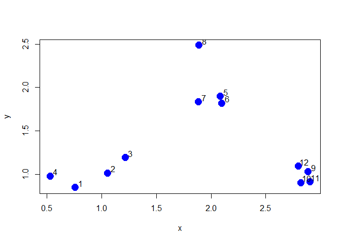
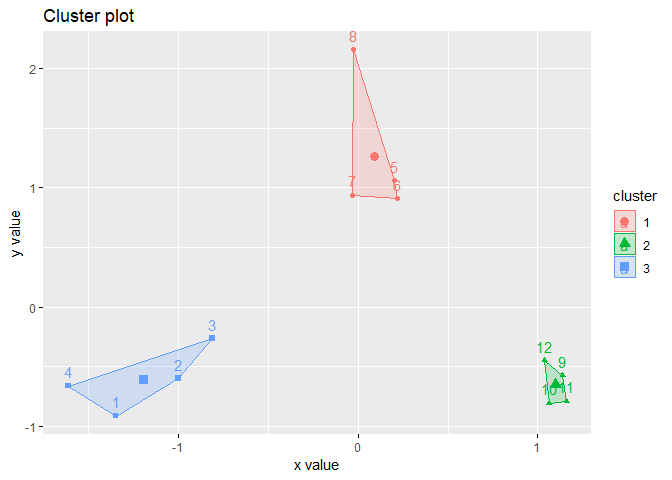

## Linear regression

### Reference : 
- SP19 Applied DS study material
- Data camp tutorial
- https://bookdown.org/rdpeng/exdata/k-means-clustering.html


```r
library(ggplot2)    # visualization library
#library(tidyverse)  # 
library(cluster)    # clustering algorithms
library(factoextra) # clustering algorithms & visualization
```

```
## Welcome! Related Books: `Practical Guide To Cluster Analysis in R` at https://goo.gl/13EFCZ
```

### Analyzing the dataset to check linear regression behavior of "displ" against "cty"

```r
glm_obj <- glm(displ ~ cty, data=mpg, family="poisson")


ggplot(data=mpg, mapping=aes(x=displ, y=cty)) +
  geom_point()
```

<!-- -->

```r
test_df <- data.frame(cty = seq(from=10, to=30,length=20))

#test_df

test_df$predicted_displ <- predict(glm_obj, test_df, type="response")

ggplot(mpg) +
  geom_point(aes(x=displ,y=cty)) +
  geom_line(aes(x=test_df$predicted_displ,y=test_df$cty), data=test_df)
```

<!-- -->

```r
#head(mpg)
```

### Plotting residual vs fitted values to understand the behavior of residuals


```r
diag <- data.frame(residuals = resid(glm_obj), fitted = fitted(glm_obj))

ggplot(data= diag, aes(x=fitted, y=residuals)) +
  geom_point()
```

<!-- -->

## Cluster analysis

### Reference :
- https://bookdown.org/rdpeng/exdata/k-means-clustering.html


```r
## Dummy data creation

## Using rnorm function to create dummy data
## Plotting it to show current distribustion of the data
## Setting labels

set.seed(1234)
x <- rnorm(12, mean = rep(1:3, each = 4), sd = 0.2)
y <- rnorm(12, mean = rep(c(1, 2, 1), each = 4), sd = 0.2)
plot(x, y, col = "blue", pch = 19, cex = 2)
text(x + 0.05, y + 0.05, labels = as.character(1:12))
```

<!-- -->

### Creating the kmeans object


```r
## Create dataframe from the dummy data
df <- data.frame(x,y)

## Create kmeans object with randomly chosen number of centers as 3
kmeansObj <- kmeans(df, centers = 3)

## Attributes available in kemens object
names(kmeansObj)
```

```
## [1] "cluster"      "centers"      "totss"        "withinss"    
## [5] "tot.withinss" "betweenss"    "size"         "iter"        
## [9] "ifault"
```

```r
## Values of some of these attributes
kmeansObj$withinss
```

```
## [1] 0.34732441 0.03298027 0.34188313
```

```r
kmeansObj$iter
```

```
## [1] 2
```

```r
kmeansObj$cluster
```

```
##  [1] 3 3 3 3 1 1 1 1 2 2 2 2
```

```r
## Visual representation of clusters using fviz
fviz_cluster(kmeansObj, data = df)
```

<!-- -->

